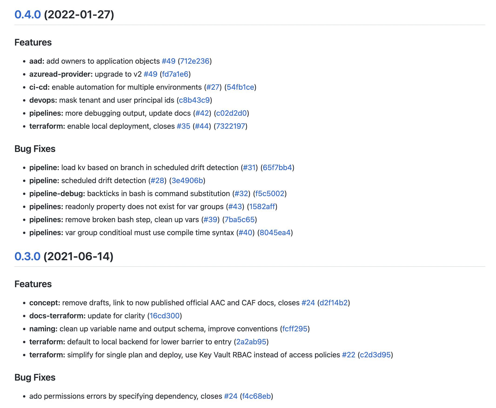
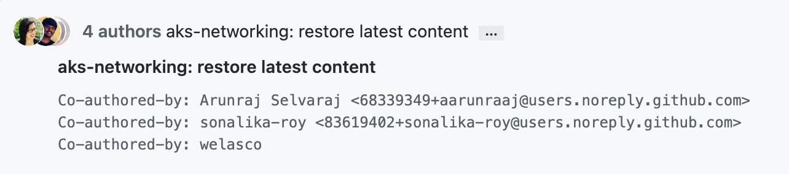
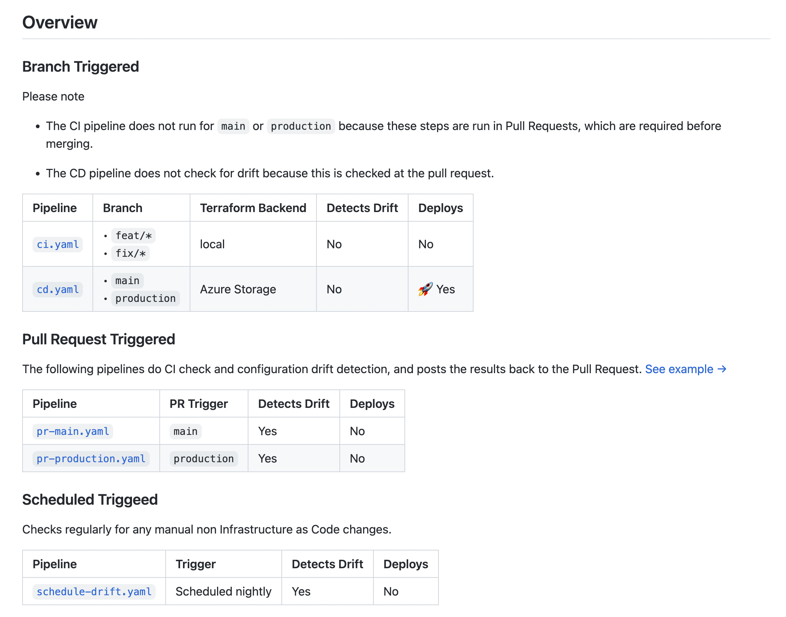
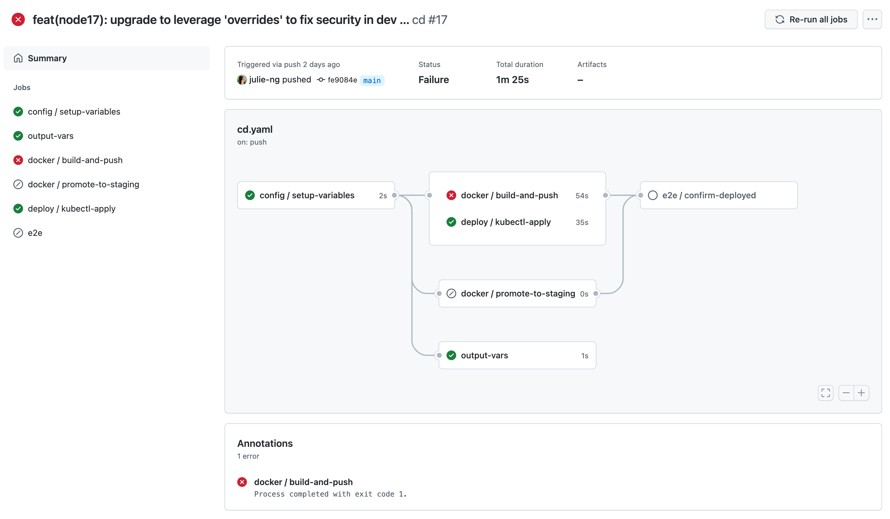

# Craftsmanship & the Art of DevOps

Note:
- so now we've given developers trust - what's next?
- IMO learning not just _how_ of DevSecOps or writing tests, 
- but the art of DevOps - Craftsmanship

---

### What does your git history look like?

- update Readme.md
- update Readme.md
- update Readme.md
- update Readme.md
- update content
- update Readme.md
- wip
- update link

---

### Why does it matter?

Common challenge - versioning, esp. with "microservices"<!-- .element: class="caption-font" -->

Note: Distributed Monoliths

---

<!-- .slide: class="small-list" -->

### ProTip - Conventional Commits

- git commit -m "feat(aad): add owners to application objects #49"
- git commit -m "feat(azuread-provider)s: upgrade to v2	#49"
- git commit -m "feat(devops): mask tenant and user principal ids"
- git commit -m "feat(pipeline): load kv based on branch in scheduled drift detection (#31)"

Note:
- Note manual edit of changelog. 
- Julie not perfect ;-)

---

### Acknowledge Others

Extra 30 seconds goes a long way for team culture<!-- .element: class="caption-font" -->

Note:
- new GitHub feature - disable forking

---

### Document for Humans

30 minutes right now saves hours * 10 teammates in future<!-- .element: class="caption-font" -->

Note:
- yes, can read code… but this is easier
- microservices, re-visitng projects
- pro-tip: use emojis

---

### Time to Mastery?

Years<!-- .element: class="fragment" -->

Note: 
- easier it looks, longer it takes

---

<!-- .slide: data-background-image="../images/clay-banks-LjqARJaJotc-unsplash.jpg" class="foo" -->

## Craftsmanship is an Investment in yourself and your teams<!-- .element: style="background: rgba(255, 255, 255, 0.6)" -->

Note:
- tests & documentation are not costs/chores.
- Craftsmanship & Developer Experience
- Small steps over time have BIG gains
