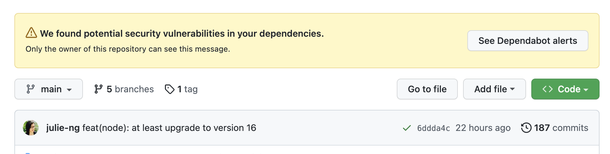
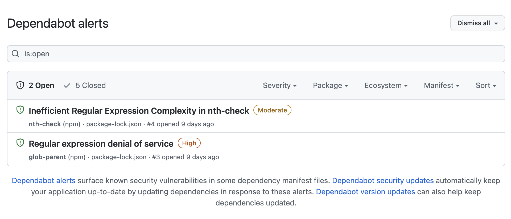
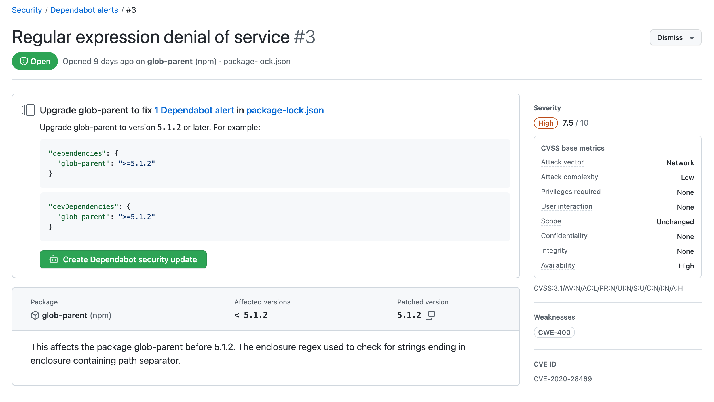
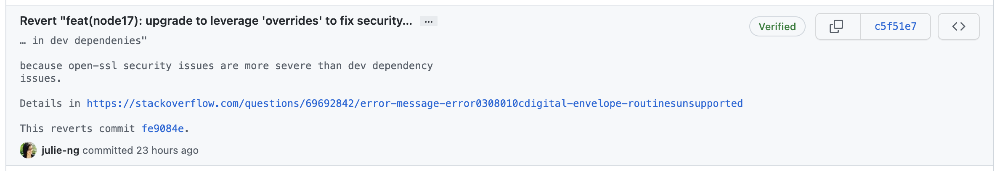
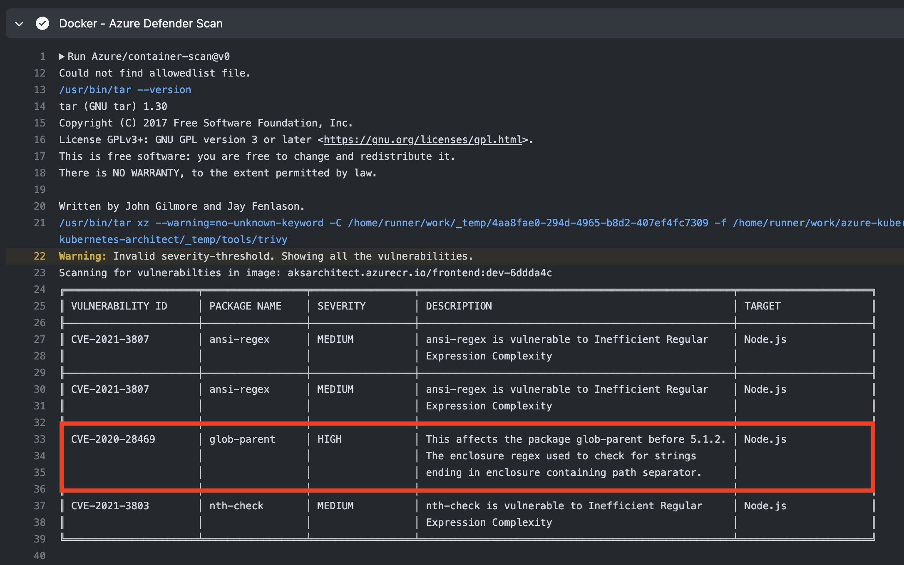
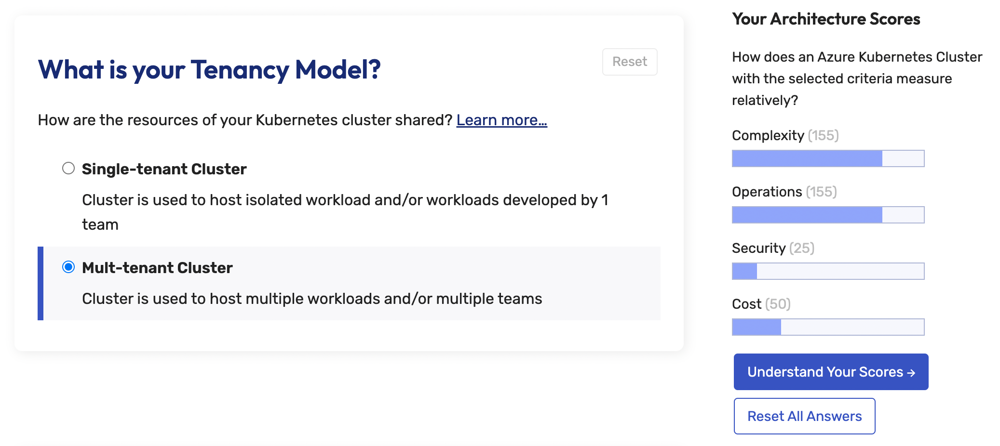
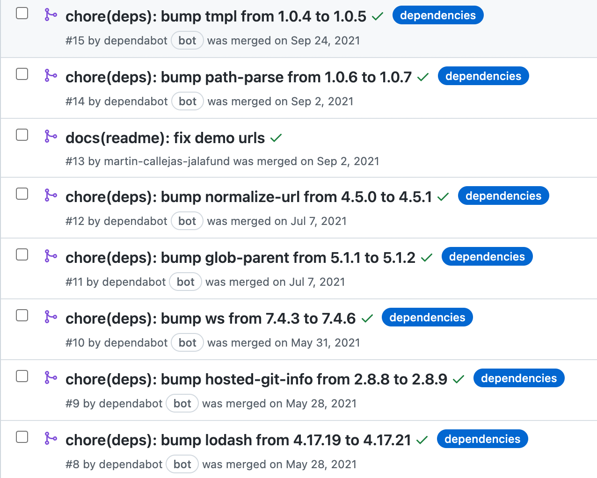

<!-- .slide: data-background-image="../images/arvin-keynes-V4mNfkDmiX4-unsplash.jpg" data-background-size="contain" data-background-position="left" class="chapter-heading-right" -->
# DevSecOps

Notes:
- People love terms like this.
- Who _doesn't_ want security?
- Makes it sound easy: I don't need to think. Let <tool X> do it for me. 
- It'll even create a Pull Request to fix my problems.
- Photo by [arvin keynes](https://unsplash.com/@arkeyphoto) on Unsplash

---


# Placeholder

- All the benefits
- All the tools

---

## in real life…



No one in webinar commented on the security warnings 🤔 <!-- .element: class="caption-font" -->

Note:
- giving demo…
- no one asked about warning 🙃

---

### High Alert 🚨



There's 3 Dependabots? alerts, security updates and version updates 🤔 <!-- .element: class="caption-font" -->

Note:
- View dependabot alerts
- 2 dependencies
  - Inefficient Regular Expression Complexity in nth-check Moderate
  - glob-parent (npm) HIGH
  - Regular expression denial of service High
    nth-check (npm)

---

### Ok, help me 🤖



---

## OK, let's try it

```
"devDependencies": {
  "glob-parent": ">=5.1.2"
}
```

```shell
$ npm update
```

---

### 🤨

```
npm WARN …
npm WARN …

removed 27 packages, and audited 1742 packages in 51s

213 packages are looking for funding
  run `npm fund` for details

15 vulnerabilities (7 moderate, 8 high)

To address all issues, run:
  npm audit fix

Run `npm audit` for details.
```

- 15 Vulnerabilities? 😧<!-- .element: class="fragment caption-font" -->
- Dependabot said 2 high vulnerabilities 🙁 <!-- .element: class="fragment caption-font" -->

---

### $ npm audit fix

```
glob-parent  <5.1.2
Severity: high
Regular expression denial of service - https://github.com/advisories/GHSA-ww39-953v-wcq6
fix available via `npm audit fix`
node_modules/watchpack-chokidar2/node_modules/glob-parent
  chokidar  1.0.0-rc1 - 2.1.8
  Depends on vulnerable versions of glob-parent
  node_modules/watchpack-chokidar2/node_modules/chokidar
    watchpack-chokidar2  *
    Depends on vulnerable versions of chokidar
# …
# …

15 vulnerabilities (7 moderate, 8 high)

To address all issues, run:
  npm audit fix
```

🤨 still 15? 

Note:
- skip the details, straigt to fix
- huh? still 15?

---

### $ npm audit fix --force

```
glob-parent  <5.1.2
Severity: high
Regular expression denial of service - https://github.com/advisories/GHSA-ww39-953v-wcq6
fix available via `npm audit fix`
node_modules/watchpack-chokidar2/node_modules/glob-parent
  chokidar  1.0.0-rc1 - 2.1.8
  Depends on vulnerable versions of glob-parent
  node_modules/watchpack-chokidar2/node_modules/chokidar
    watchpack-chokidar2  *
    Depends on vulnerable versions of chokidar
# …

15 vulnerabilities (7 moderate, 8 high)

To address all issues, run:
  npm audit fix
```

😫 still 15

---

<!-- .slide: data-background-image="../images/juan-rumimpunu-nLXOatvTaLo-unsplash.jpg" class="text-align-left" -->

### Now What?

- <!-- .element: class="fragment" -->Tools optimize for <strong>knowing</strong> …
- <!-- .element: class="fragment" -->Humans optimize for <strong><em>learning</em></strong>


Note:
- Missing - so what's next?
- after Googling & Stack Overflowing…

---

## npm overrides

```json
{
  "overrides": {
    "glob-parent": "6.0.2",
    "nth-check": "2.0.1"
  }
}
```

but requires update to npm v8, i.e. node v17

---

## Let's upgrade node

- Update `.nvmrc`
- Update `Dockerfile`
- `node-engine` in `package.json`
- `npm run preflight && git push` ✅

Note:
- Simple enough. I have tests.

---

### But CI says ⛔️

```
ℹ Compiling Client
node:internal/crypto/hash:67
  this[kHandle] = new _Hash(algorithm, xofLen);

Error: error:0308010C:digital envelope routines::unsupported
    at new Hash (node:internal/crypto/hash:67:19)    
    // …
    at FSReqCallback.readFileAfterClose [as oncomplete] (node:internal/fs/read_file_context:68:3) {
  opensslErrorStack: [ 'error:03000086:digital envelope routines::initialization error' ],
  library: 'digital envelope routines',
  reason: 'unsupported',
  code: 'ERR_OSSL_EVP_UNSUPPORTED'
}

Node.js v17.7.1
The command '/bin/sh -c npm ci --production && npm run nuxt:build' returned a non-zero code: 1
```

Upsupported Open SSL? No Thanks. <!-- .element: class="caption-font" -->

---

# Nevermind. Revert. 



Note:

- Best Practice - document in your git commit messages

---

## Sorry, gotta deploy

```yaml
# github workflow

steps:
  - run: npm audit --audit-level=moderate
    continue-on-error: true
```

but thanks for the alert 😉 <!-- .element: class="caption-font" -->

Note:
- we don't remove it, we just continue

---

## You too Defender Scan


```yaml
steps:
- uses: Azure/container-scan@v0	
  continue-on-error: true	
  with:
    image-name: ${{ env.image-name }}:dev-${{ inputs.git-sha }}
    severity-threshold: WARN

```

Thanks for the alert 🤗 <!-- .element: class="caption-font" -->

Note:
- again, we just continue

---

### Microsoft Defender Results



Note:
- same vulnerability

---

# Does it even matter?

- Builds running again
- Now, let's reflect on our decision to **ignore a vulnerability**
  - What is \`glob-parent\` and how is it used?<!-- .element: class="fragment" -->
  - What is the Open SSL issue and how is that used?<!-- .element: class="fragment" -->
  - <!-- .element: class="fragment" --><strong>What is this app even trying to do? 🤔</strong>

Note: 
- this is how humans roll

---

<!-- .slide: data-background-image="../images/snyk-globparent-1.png" data-background-size="contain" -->

Note:
- Snyk - favorite catalog for CVEs (common vulnerabilities and exposures)
- https://security.snyk.io/vuln/SNYK-JS-GLOBPARENT-1016905


---

<!-- .slide: data-background-image="../images/snyk-globparent-2.png" data-background-size="contain" -->

## DDoS via slowing it down.<!-- .element: class="fragment heading-over-image" -->

Note:
- Snyk also explains how it works

---

# What are we globbing for?



Interactive (not a checklist) App

---

# Headless CMS

```
---
title: Mult-tenant Cluster
description: Cluster is used to host multiple workloads and/or multiple teams
complexity:  100
security: -25
cost: 0
operations: 100
---

Multi-tenancy is incredibly complex. For example, Ingress, which manages external access to your cluster.
 
```

---

# What we're Globbing

```
.
├── index.md
└── requirements
    ├── dr.md
    ├── factors
    │   ├── dr-active-active.md
    │   ├── dr-active-passive.md
    │   ├── dr-redeploy.md
    │   ├── dr-wait.md
    │   ├── multi-tenant.md
    │   └── single-tenant.md
    └── tenancy.md
```

Missing Security Context<!-- .element: class="fragment" data-fragment-index="1" -->
- App has no user input<!-- .element: class="fragment" data-fragment-index="1" -->
- App has a build process<!-- .element: class="fragment" data-fragment-index="1" -->

---

# Conclusion?

- tooling is about knowing
- tools are stupid. can't think for themselves
- but they will not teaching you thinking, learning
- **tooling does not give you context**
- context is experience
- can't run a marathon without first running, 5k, 10k, half marathon
- too many notifications

---

# When Security becomes a todo…


