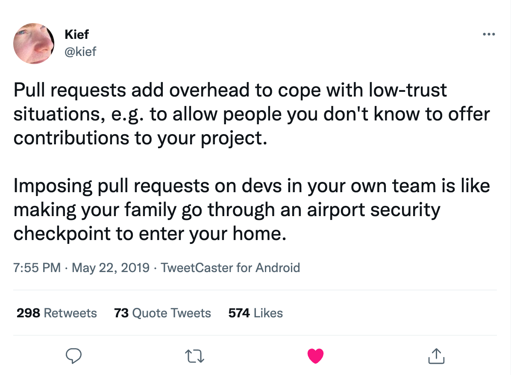
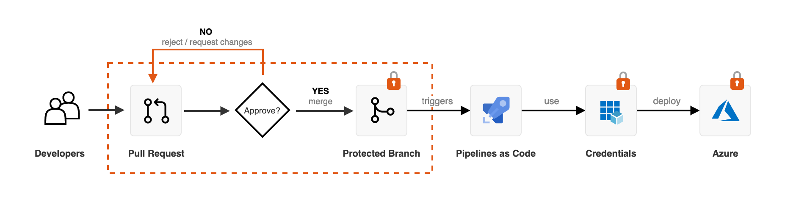
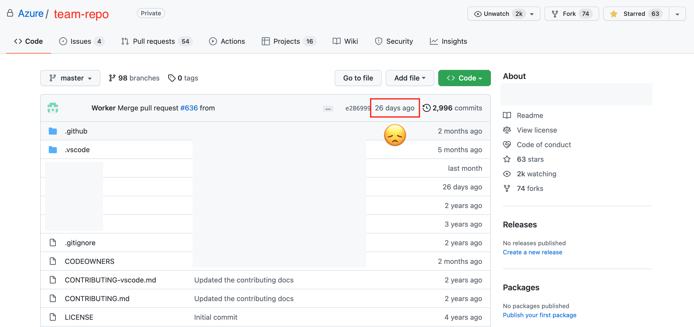
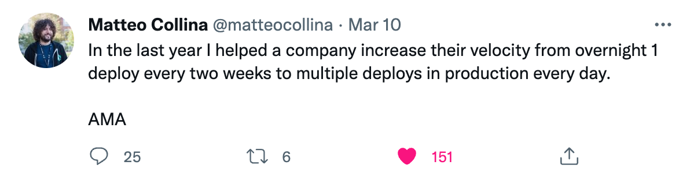

<!-- .slide: data-background-image="../images/stop-light.jpg"  class="chapter-heading-right"  -->

# Pull Requests<!-- .element: style="background: rgba(0, 0, 0, 0.8); display: inline-block" -->

Best Practice…<!-- .element: style="color:#111" -->

Note:

- Peer review
- Automated tests for better quality
- Combine with Branch protection for more security

---

### Pull Request Workflow

- `git checkout main && git merge feature`
- `git push`
- Open a Pull Request<!-- .element: class="fragment" -->
- `#signoff` <!-- .element: class="fragment" -->
- `#signoff` <!-- .element: class="fragment" -->
- `#signoff` <!-- .element: class="fragment" -->
- Give Up 🤷‍♀️ & (don't) Close Pull Request<!-- .element: class="fragment" -->

Note:
- as dev, finished
- frustrated

---

## Slow Pull Requests

- `git push`
- waiting for build agent…30 sec
- waiting for build agent…30 sec
- opens Twitter
- 60 minutes later…
- Build Failed. No deployment, no value add 🤷‍♀️

Note:
- shared agents, pricing plan

---

<!-- .slide: data-background-image="../images/minku-kang-5d2QJl88QbI-unsplash.jpg" class="foo" -->

Note:
Pull Requests Run Amok

---

---

### Stuck in a Loop?

---

### Lower Velocity, Less Business Value

Note:
- internal repo, screenshot this morning
- for _daily work_
- 26 days ago? Slow
- 54 stuck PRs
- 16 projects

---

### How to Deploy Everyday

<!-- .element: class="fragment" -->

Note:
- overnight deployments every 2 weeks
- EVERY DAY!
- Trust
- When do you need it? Open Source, fork + PR workflow
- Theory: Pull Request != Quality or Craftsmanship

---

### Team Decides

Team choosing to deploy outside of business hours?<!-- .element: class="caption-font" -->

Note:
- Now that we cover security can backfire… let's look at DevSecOps, best of intentions…
- Trust your team… but others?